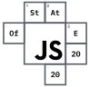

<!-- 标题 -->
# Markdown语法
---
## 标题
```
语法：
# 第一大标题
## 第二大标题
### 第三大标题
#### 第四大标题
##### 第五大标题
###### 第六小标题
```
# 第一大标题
## 第二大标题
### 第三大标题
#### 第四大标题
##### 第五大标题
###### 第六小标题

---
## 分割线

<!-- 分隔线 -->
```Typescript
语法：
---
***
```
---
***

---
## 引用
```Typescript
语法：
>引用文本
>>嵌套的引用文本
>>>无限嵌套下去
```
>引用文本
>>嵌套的引用文本
>>>无限嵌套下去
>>>>第四个
>>>>>无限嵌套下去
>>>>>>无限嵌套下去
>>>>>>>无限嵌套下去
>>>>>>>>无限嵌套下去
>>>>>>>>>无限嵌套下去
>>>>>>>>>>无限嵌套下去
>>>>>>>>>>>无限嵌套下去

---

## 引用图片链接（本地图片、网络图片）
```
语法：

```
本地图片




### 网络图片


---

## 超链接
跟图片链接少了一个 `!`
```
[TypescriptSyntax](https://www.typescriptlang.org/)
[链接名称](链接地址)
```
[TypescriptSyntax](https://www.typescriptlang.org/)

---

## 代码块（指定代码语言）
```
' ``` '
' ``` '
```编程语言
```
```Typescript
type CreateArr<N extends number, CountArr extends unknown[] = []> = 
  N extends CountArr['length']
    ? CountArr['length']
    : CreateArr<N, [...CountArr, unknown]>
```

---

## 列表
### 无序列表
```
使用 *
* 第一行
* 第二行
* 第三行
使用 +
+ 第一行
+ 第二行
+ 第三行
使用 -
- 第一行
- 第二行
- 第三行
嵌套用法
* 父文本
 * 子文本
```

* 第一行 *
* 第二行 *
* 第三行 *
+ 第一行 +
+ 第二行 +
+ 第三行 +
- 第一行 -
- 第二行 -
- 第三行 -

* 父文本
  * 子文本
---

### 有序列表
```
语法：英文句号+加空格
1. 第一行
2. 第二行
3. 第三行
```
1. 第一行
2. 第二行
3. 第三行

---

### 强调
斜体
```
*斜体*
<em>粗体</em>
```

*斜体*

<em>em标签</em>

强调
```
**强调**

```
**强调**

粗体
```
<string>粗体<string>
```
<em>粗体</em>

删除线
```
~~删除线 不支持？？？？
<del>已经完成的事画删除线</del>
```
~~删除线 

<del>用html标签del写的已经完成的事画删除线</del>

---

## 邮箱
```
语法：
<1359774872@qq.com>
```
<1359774872@qq.com>

---

## 行内标记
```
`标记`
```
`Typescript`

